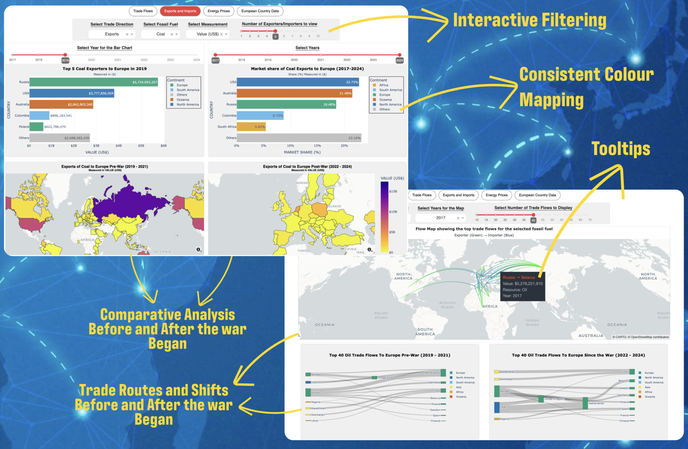

<H1 align="center">
  <strong>Visualising Disruptions of the Ukraine-Russia War on Europe's Fossil Fuel Trade</strong>
</H1>
<H4 align="center">
  A fully functional interactive web-based dashboard that allows you to explore the European fossil fuel trade disruptions since the start of the Ukraine-Russia war.
</H4>

<p align="center">
  
</p>

This web application allows users to explore and visualise the disruptions caused by the Ukraine-Russia war. This interactive dashboard provides insights into the shifting trade routes, key suppliers, and the economic trends that have emerged between 2017 and 2024. This project was a part of my Dissertation taken in my final year at Newcastle University.

# Getting started

1. In-order to use this app you need to make sure you have the requirements installed from the requirements folder.

```
pip install -r requirements.txt
```

2. Follow this link and get an API key https://www.mapbox.com/
3. Create a `.env` file and place the API key as followed:`MAPBOX_ACCESS_TOKEN=*YOUR API KEY*`
4. Next run the command to start the application

```
python app.py
```
